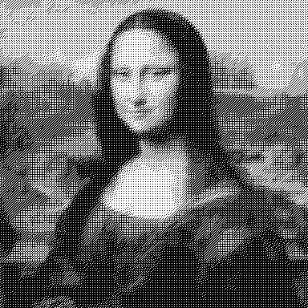

# Dither

## Description
Simple image dithering tool.

## Dependencies
- Python 3.
- PIL and numpy packages for Python 3.

## Usage
```shell
python3 dither.py <input_image> <output_image>
```

## License
This code is licensed under the terms of the MIT license.

## Example
